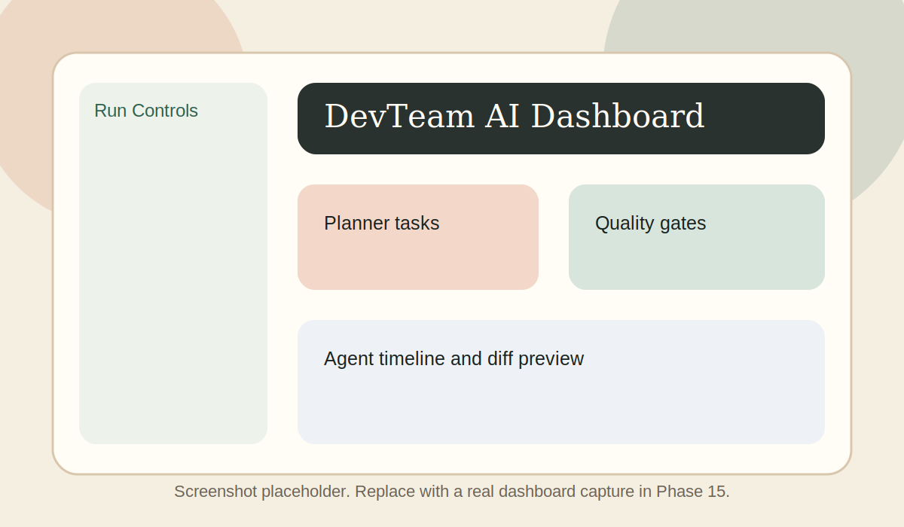
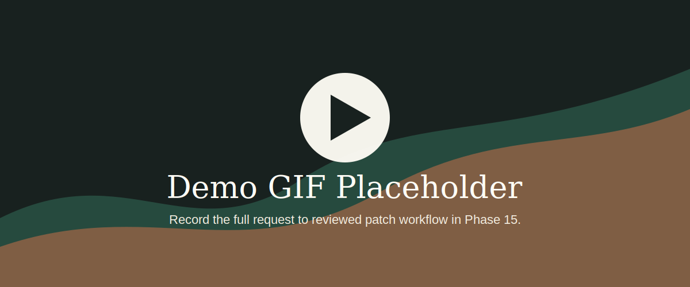
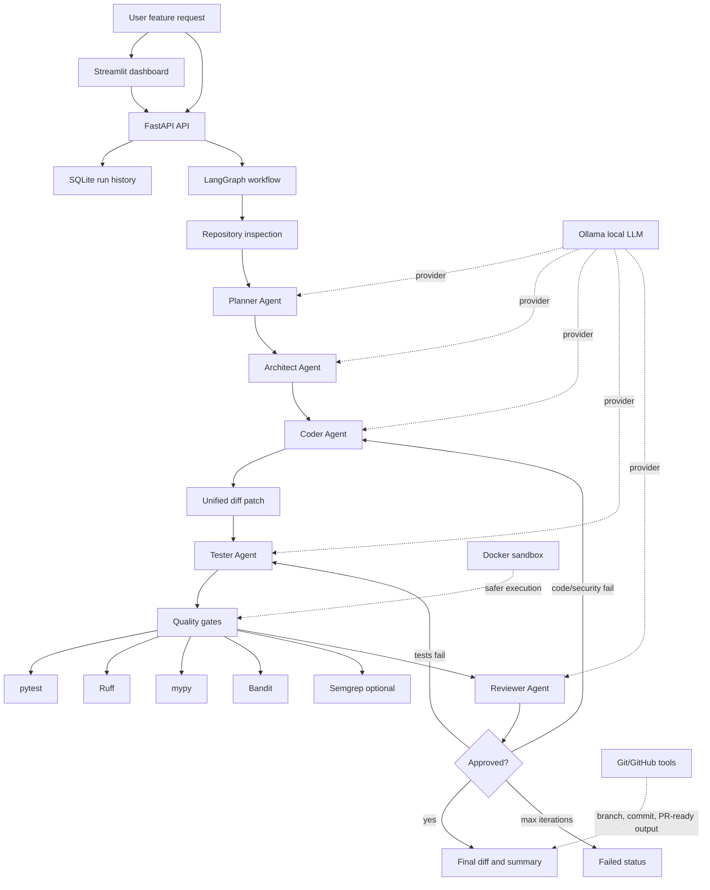

# DevTeam AI

[](https://github.com/Sailokeshg/DevTeam_AI/actions/workflows/ci.yml)


DevTeam AI is a local-first multi-agent software development system that behaves like a small engineering team. It accepts a feature request, inspects a repository, creates an implementation plan, proposes architecture, generates patches and tests, runs quality gates, reviews the result, and iterates until the change is approved or the workflow reaches a maximum iteration count.

This project is built to be resume-worthy: typed agent contracts, deterministic tests, CI quality gates, Docker sandboxing, a Streamlit dashboard, and safe Git/GitHub workflow helpers.

## Highlights

- Planner, Architect, Coder, Tester, and Reviewer agents with typed Pydantic outputs.
- LangGraph workflow orchestration with conditional repair routing.
- Ollama as the default local/free LLM provider, with provider abstraction for future models.
- Patch-based code changes instead of unrestricted shell execution by agents.
- pytest, Ruff, mypy, Bandit, and optional Semgrep quality gates.
- Docker sandbox runner with command allowlisting and CPU, memory, PID, filesystem, and network controls.
- FastAPI run-management API with SQLite run history.
- Streamlit dashboard for local demos.
- Git helpers for clone, branch, diff, commit, PR title/body generation, and optional GitHub PR creation.

## Demo Preview





## Architecture



More detail: [docs/architecture.md](docs/architecture.md)

## Repository Structure

```text
devteam-ai/
├── backend/                 # FastAPI app, agents, schemas, graph, tools, tests
├── ui/                      # Streamlit dashboard
├── prompts/                 # Agent prompt templates
├── examples/                # Demo repositories
├── docs/                    # Architecture, demo script, resume bullets
├── .github/workflows/       # CI quality gates
├── docker-compose.yml
├── AGENTS.md
├── README.md
└── LICENSE
```

## Local Setup

```bash
python3 -m venv .venv
source .venv/bin/activate
pip install -e "backend[dev,ui]"
```

Start the backend:

```bash
cd backend
uvicorn app.main:app --reload
```

Health check:

```bash
curl http://127.0.0.1:8000/health
```

Expected response:

```json
{"status": "ok"}
```

Start the dashboard in another terminal:

```bash
streamlit run ui/streamlit_app.py
```

## Ollama Setup

DevTeam AI uses Ollama as the default local/free LLM provider.

```bash
ollama serve
ollama pull llama3.1
```

Optional environment variables:

```bash
export OLLAMA_BASE_URL="http://127.0.0.1:11434"
export OLLAMA_MODEL="llama3.1"
export OLLAMA_TIMEOUT_SECONDS="30"
```

Tests use fake providers and do not require Ollama.

## Example Run

Start a synchronous run through the API:

```bash
curl -X POST http://127.0.0.1:8000/runs \
  -H "Content-Type: application/json" \
  -d '{
    "repository_path": "/absolute/path/to/local/repo",
    "feature_request": "Add a /ping endpoint with tests",
    "max_iterations": 3
  }'
```

Inspect the run:

```bash
curl http://127.0.0.1:8000/runs/<run_id>
curl http://127.0.0.1:8000/runs/<run_id>/diff
curl http://127.0.0.1:8000/runs/<run_id>/logs
```

The Streamlit dashboard can start the same run and display the agent timeline, task list, architecture plan, diff, tests, static-analysis results, reviewer feedback, and final status.

## Evaluation Results

Phase 15 adds curated demo tasks and a deterministic evaluation harness for
`examples/fastapi-demo-app`.

Run the evaluation from the repository root:

```bash
python scripts/evaluate_demo_tasks.py
```

Latest saved results:

| Task | Status | Iterations | Files Changed | Tests Passed | Quality Gate |
| --- | --- | ---: | ---: | ---: | --- |
| Add health endpoint | passed | 1 | 2 | 1 | passed |
| Add input validation | passed | 2 | 2 | 2 | passed |
| Add JWT auth skeleton | passed | 2 | 2 | 2 | passed |
| Fix failing test | passed | 1 | 2 | 1 | passed |

Saved artifacts live in [docs/example-runs](docs/example-runs/).

## Docker Sandbox

Build the sandbox image:

```bash
docker build -f backend/Dockerfile.sandbox -t devteam-ai-sandbox:latest backend
```

Allowed sandbox commands:

- `pytest`
- `ruff`
- `mypy`
- `bandit`
- `semgrep`

Sandbox defaults disable network access, mount only the selected repository at `/workspace`, use a read-only container filesystem, and apply timeout, memory, CPU, and PID limits.

## Git And GitHub Workflow

Phase 13 adds safe local Git helpers for clone, branch, diff, and commit operations. Optional GitHub PR creation uses the GitHub CLI and requires explicit approval in code.

```bash
brew install gh
export GITHUB_TOKEN="your_token_here"
```

Safety rules:

- Push and PR creation require `approved=True`.
- Tokens are read from environment variables and never sent to agents.
- Token values are redacted from command errors.
- Branch names, refs, paths, and clone URLs are validated before commands run.

## Quality Gates

Run locally from `backend/`:

```bash
pytest
ruff check .
ruff check ../ui --config pyproject.toml
ruff format --check .
ruff format --check ../ui --config pyproject.toml
mypy app
bandit -r app
```

The GitHub Actions workflow runs the same core checks on pushes and pull requests to `main`.

## Documentation

- [Architecture](docs/architecture.md)
- [Agent state](docs/agent-state.md)
- [Demo script](docs/demo-script.md)
- [Resume bullets](docs/resume-bullets.md)
- [Example runs](docs/example-runs/summary.md)

## Current Phase Status

Completed through Phase 15:

- Phase 0: Project scaffold and developer setup
- Phase 1: Core schemas and shared workflow state
- Phase 2: LLM provider abstraction with Ollama
- Phase 3: Prompt templates and Planner/Architect agents
- Phase 4: Repository inspection and file tools
- Phase 5: Coder Agent with patch-based changes
- Phase 6: Tester Agent and pytest runner
- Phase 7: Static analysis tools
- Phase 8: Reviewer Agent and repair loop
- Phase 9: LangGraph workflow orchestration
- Phase 10: FastAPI endpoints
- Phase 11: Streamlit dashboard
- Phase 12: Docker sandbox execution
- Phase 13: Git and GitHub integration
- Phase 14: CI/CD and portfolio polish
- Phase 15: Evaluation and example runs

## Limitations

- Workflow runs are synchronous today, so long agent runs block the request.
- Local LLM quality depends on the installed Ollama model.
- Docker sandboxing is safer than host execution, but not a perfect security boundary.
- GitHub PR creation requires `gh` and a configured token.
- The dashboard is built for demos, not production multi-user operations.

## Future Improvements

- Background job queue and streaming run updates.
- GitHub clone, branch, commit, and PR flow wired directly into the API/UI.
- More provider implementations beyond Ollama.
- Evaluation harness with repeatable benchmark tasks and saved example outputs.
- Richer dashboard screenshots and a recorded demo GIF.
- Stronger sandbox profiles for language-specific package installation.

## License

MIT. See [LICENSE](LICENSE).
