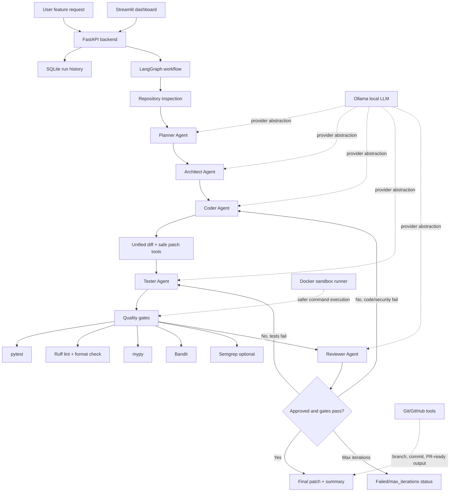

# DevTeam AI Architecture

DevTeam AI is a local-first multi-agent software development system. It accepts a feature request, inspects a repository, plans implementation tasks, designs an approach, proposes patches, generates tests, runs quality gates, reviews the result, and iterates until approved or the run reaches the configured iteration limit.

## System Diagram

## Core Components

- `backend/app/api`: FastAPI routes for health checks and synchronous workflow runs.
- `backend/app/agents`: Planner, Architect, Coder, Tester, and Reviewer agents.
- `backend/app/graph`: LangGraph orchestration, routing, and repair loop behavior.
- `backend/app/llm`: Provider abstraction with Ollama as the default local provider.
- `backend/app/schemas`: Typed Pydantic contracts for tasks, plans, results, review feedback, and shared state.
- `backend/app/tools`: Repository file tools, patch tools, test/static-analysis runners, Docker sandbox runner, and Git/GitHub helpers.
- `backend/app/storage`: SQLite run history.
- `ui/streamlit_app.py`: Dashboard for demoing workflow runs.
- `prompts/`: Role-specific prompts used by each agent.

## Workflow State

`AgentState` is the source of truth for a run. It tracks the original request, repository path, repository summary, task list, architecture plan, changed files, patch/diff, test results, static-analysis results, review result, iteration count, and final status.

The state object is intentionally explicit so API responses, Streamlit display, persistence, tests, and LangGraph nodes all use the same contract.

## Safety Model

DevTeam AI avoids giving agents unrestricted host access.

- File tools validate paths and prevent traversal outside the selected repository.
- Coder and Tester agents produce patches instead of running arbitrary shell commands.
- Quality commands can be run through a Docker sandbox with CPU, memory, PID, filesystem, and network constraints.
- GitHub tokens are never sent to agents and are redacted from command errors.
- Push and PR creation helpers require explicit approval flags.

## Current Limitations

- Runs are synchronous today; background jobs and streaming updates are future work.
- Local LLM quality depends on the installed Ollama model.
- Docker sandboxing is safer than host execution, but not a perfect security boundary.
- GitHub PR creation is optional and requires the `gh` CLI plus a configured token.
- The current UI is demo-focused rather than a full production operations console.
